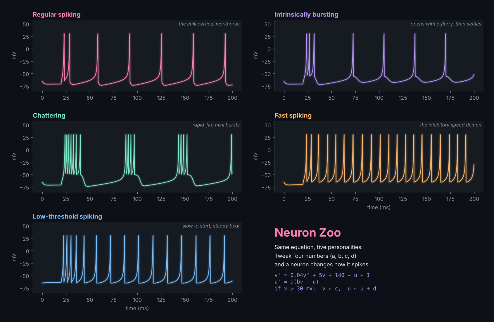

# Neuron Zoo

Five neurons, one equation, five totally different personalities. Built on Izhikevich's 2003 spiking neuron model, where changing just four numbers turns a calm cortical cell into a rapid-fire chatterer.

## Run it

    pip install numpy matplotlib
    python zoo.py

## Play with it

Edit the `(a, b, c, d)` values in `ZOO` inside `zoo.py`, or add your own entry. Try `c = -45` for wilder bursting.

## Neuroscience notes

- **a**: how fast the recovery variable `u` reacts
- **b**: how sensitive `u` is to the membrane voltage
- **c**: voltage reset after a spike
- **d**: how much `u` jumps after a spike (this controls adaptation)

Reference: Izhikevich, E. M. (2003). Simple model of spiking neurons. IEEE Transactions on Neural Networks.
